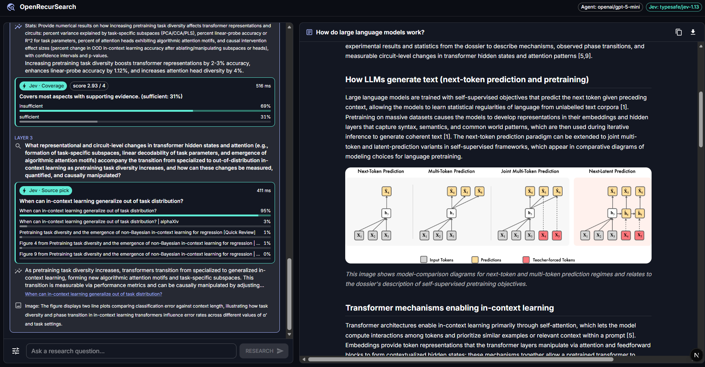
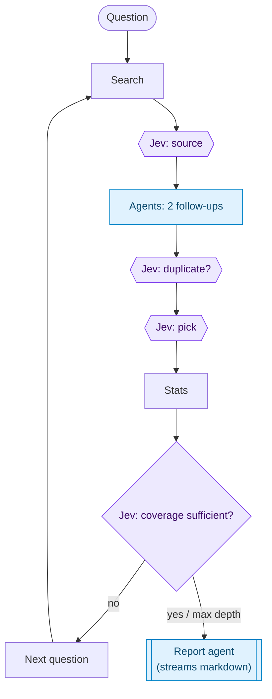

# OpenRecurSearch

Open Multi Agent Research Web Interface, backed by recursearch algo, generate
research reports, see agents + jev live in action all on your local machine
using models you like.


Ask a question in the chat. Each research layer and each Jev decision appears there live, with its option probabilities, score and latency. Meanwhile the markdown report streams into the side panel.



## Recursearch Info

view detailed info about Recursearch [here]()

## How OpenRecurSearch Works

RecurSearch went layer by layer, using LLM "picker" and "validator" agents to make choices. Those choices are *decisions*, so this app hands them to Jev, a System One model that returns typed choices instead of generated text. The LLMs only generate.



All run state lives inside a single run, so concurrent users never share findings. The original kept findings in module-level globals, which runs shared.


## Quick start

Requires **Node.js 20.9+**.

```bash
npm install
cp .env.example .env.local   # then fill in the keys
npm run dev                  # http://localhost:3000
```

Minimum `.env.local`:

```env
OPENROUTER_API_KEY=sk-or-...
OPENROUTER_MODEL=openai/gpt-5-mini     # any OpenRouter model id
TAVILY_API_KEY=tvly-...
EXA_API_KEY=                           # optional, for statistics
```

With only an OpenRouter key, both the agents and Jev work. See `.env.example` for every option: Jev provider and model, early-stop and duplicate thresholds, depth limits, and whether the UI may override the model.

## Example Reports

see ```./generatedReports``` for real reports generated by OpenRecursearch at level 3, using gpt-5-mini + jev


## Credits

Based on recursearch project [RecurSearch](https://github.com/jalpp/recursearch)

## Author

[@jalpp](https://github.com/jalpp).
